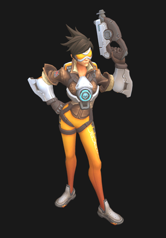
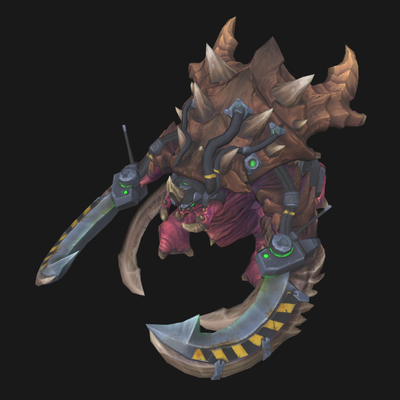
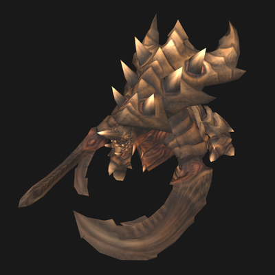
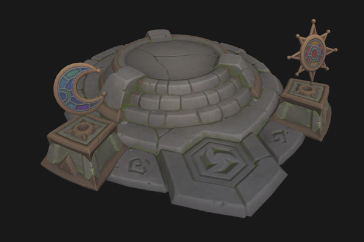

# m3-to-glb

[](https://github.com/AestroFidelium/m3-to-glb/actions/workflows/ci.yml)
[](https://crates.io/crates/m3-to-glb)
[](https://docs.rs/m3-to-glb)
[](https://codecov.io/gh/AestroFidelium/m3-to-glb)
[](LICENSE)

Converts Blizzard **M3** models — StarCraft II and Heroes of the Storm — into
**glTF 2.0 binary** (`.glb`) that opens in Blender, three.js, Bevy or any glTF
viewer. Geometry, materials and textures, the skeleton, every animation, and the
model's particle effects all come across.

```console
$ m3-to-glb Ultralisk.m3 -t textures/
✓ Ultralisk.m3 → Ultralisk.glb (1 mesh, 72 bones, 23 animations, 3 textures)
```

<table>
  <tr>
    <td align="center"></td>
    <td align="center"></td>
    <td align="center"></td>
  </tr>
  <tr>
    <td align="center">Tracer — Heroes of the Storm</td>
    <td align="center">Ultralisk — Heroes of the Storm</td>
    <td align="center">Ultralisk — StarCraft II</td>
  </tr>
  <tr>
    <td colspan="3" align="center"><br>Dragon Shire altar — a map prop</td>
  </tr>
</table>

<sub>Converted `.glb` files in the <a href="https://gltf-viewer.donmccurdy.com/">three.js glTF viewer</a>, with every animation clip available to play.</sub>

## What comes across

- **Meshes** — positions, normals, tangents and UVs, whatever vertex layout the
  file uses.
- **Materials** — diffuse, normal, emissive and ambient-occlusion textures,
  alpha blending and alpha testing, two-sided surfaces, flat-colour layers.
  Textures are looked up by name in a folder you point at and embedded.
- **Skeleton and animations** — bones, skinning, and every clip from the model
  and its companion `.m3a` files.
- **Effects** — particle systems, lights and ground decals become empty nodes on
  the bone they ride, with their full settings in the node's `extras`
  ([format](docs/fx-extras.md), [Bevy runtime](integration/bevy/m3fx.rs)).
- **Attachment points** — `Ref_Head`, `Ref_Weapon Right`, … are marked on their
  bone nodes ([format](docs/attachments.md)).

Every one of the 33,365 models shipped with StarCraft II converts to a valid
file. A Heroes of the Storm hero takes about 5 ms; the largest SC2 model
(9.5 MB) about 60 ms.

## Install

```bash
cargo install m3-to-glb
```

Prebuilt binaries for Linux, Windows and macOS are on the
[Releases](https://github.com/AestroFidelium/m3-to-glb/releases) page. With Nix,
`nix run github:AestroFidelium/m3-to-glb -- model.m3` runs it without installing.

## Usage

```bash
m3-to-glb model.m3                                  # → model.glb next to it
m3-to-glb hero.m3 -t textures/ -a hero_anims.m3a    # textures + companion animations
m3-to-glb hero.m3 -t textures/ --ktx2               # GPU-compressed KTX2 textures
```

| Option | |
|---|---|
| `-o, --output <FILE>` | Output path. Default: the input with a `.glb` extension. |
| `-t, --textures <DIR>` | Texture folder, searched recursively by file name. Default: the model's own folder, if it holds images. |
| `-a, --anims <M3A>` | Companion animation file. Repeatable. |
| `--ktx2` | Transcode textures to KTX2 (UASTC + Zstd, mipmaps) with `KHR_texture_basisu`. Needs [`toktx`](https://github.com/KhronosGroup/KTX-Software) on `PATH` (bundled with the Nix package). |
| `--max-tex-size <PX>` | Downscale textures so neither side exceeds `PX`. |
| `--no-fx` | Leave particle effects, lights and decals out. |
| `--bevy-compat` | With `--ktx2`: reference KTX2 images the way Bevy 0.17 expects. **Not valid glTF** for other tools. |
| `-q, --quiet` / `-v, --verbose <LEVEL>` | Errors only / log level (`warn` by default). |
| `--completions <SHELL>` | Print a completion script for bash, fish, zsh, elvish or PowerShell. |

Newer Heroes of the Storm heroes use `MADD` materials, which list textures
without saying what each one is for; the converter goes by the file name
suffix: `_diff`, `_norm`, `_emis`, `_ao`.

## Library

```toml
[dependencies]
m3-to-glb = { version = "0.2", default-features = false }  # without the CLI's dependencies
```

```rust
use m3_to_glb::{Converter, TextureCache};

let model = std::fs::read("hero.m3")?;
let anims = std::fs::read("hero_anims.m3a")?;
let textures = TextureCache::build("textures/")?;

let glb = Converter::new().animations(&anims).textures(&textures).convert(&model)?;
std::fs::write("hero.glb", &glb.bytes)?;
```

Conversion works on bytes in memory; a model that is too damaged to convert
returns an [`Error`](https://docs.rs/m3-to-glb/latest/m3_to_glb/enum.Error.html),
never a panic. The individual stages — parsing, geometry, GLB packing — are
public as well. See the [API docs](https://docs.rs/m3-to-glb).

## How it works

M3 has no public specification; everything known about it comes from community
reverse engineering. The converter reads the file's tag table straight from
memory without copying, decodes each vertex layout with SIMD (AVX2 / SSE4.1 /
NEON, chosen at run time), converts mesh divisions in parallel, rotates the
Z-up model into glTF's Y-up, and computes the skin's bind matrices from the bone
hierarchy.

The code is held to a high bar: the library contains no `unsafe`, `clippy`
runs with the `pedantic` set and warnings as errors, and test coverage is
above 99 %. Since the game's files cannot be published, the tests generate
their own M3 files; a fuzzer builds random models, corrupts them and checks that
every output is a valid glTF. Run it all with `cargo test`, or fuzz with
`cargo bolero test --profile fuzz fuzz_whole_pipeline`.

## Limitations

- Effects are exported as data, not drawn: a plain glTF viewer shows empty
  nodes where emitters are. An engine has to spawn them from the `extras`.
- DDS and TGA textures are embedded as they are. Bevy and three.js read them,
  but strict validators accept only PNG and JPEG — use `--ktx2`, or convert the
  texture folder first.
- Effects in the oldest StarCraft II files (`PAR_` before v22, `PROJ` before
  v5 — mostly Wings of Liberty assets) are skipped with a warning; the model
  itself converts normally.
- Geometry that the game shows only during certain animations is left out, as
  it is in the idle pose.
- Newer Heroes of the Storm materials (`MADD`) are shader node graphs; only
  their textures and blend mode are read. Glass whose opacity comes from the
  shader rather than a texture, such as Tracer's goggles, renders opaque.
- Not exported: animated UVs and material colours, ribbons, physics shapes,
  cameras. Composite materials use their first layer.

## Credits

This project would not exist without the people who reverse-engineered
the M3 format and published their findings.

- [**Solstice245/m3studio**](https://github.com/Solstice245/m3studio) —
  Blender add-on used as the behavioural reference. Vertex
  description, material slot layout, animation lookup logic and the
  `key_fcurves` filtering rules all trace back to this codebase.
- [**SC2Mapster/m3addon**](https://github.com/SC2Mapster/m3addon) —
  original `structures.xml`, the canonical description of every M3
  tag and field used by this converter.

The `structures.xml` file in turn credits a long line of contributors
who reverse-engineered the format over the years:

> *Florian Köberle — who created the first version of this file by
> using existing descriptions of the m3 file format · NiNtoxicated —
> who made an m3 Exporter and Importer for 3ds max · Leruster — who
> helped improving the structure.xml file · Witchsong (libm3) — who
> made an M3 library and helped NiNtoxicated on sequence data · Teal
> — PHP M3 parser · Blue Isle Studios · Volcore — who helped figure
> out vertex flags · Sixen (sc2mapster.com) · der_Ton — MD5 work that
> M3 is similar to · MrMoonKr · Skizot · Phygit · ufoZ — original M2
> reverse engineer · the SC2Mapster community · CaptainD001
> (M3_Import) · Talv · TangorCraft (M3 Editor) · Solstice245 · Renee.*

If you reuse the XML or any code generated from it, please carry
those credits forward.

## License

**GPL-2.0-only** — see [`LICENSE`](LICENSE).

This matches the licence of `m3studio` and `m3addon`, the projects
that supplied the format knowledge this converter is built on.
